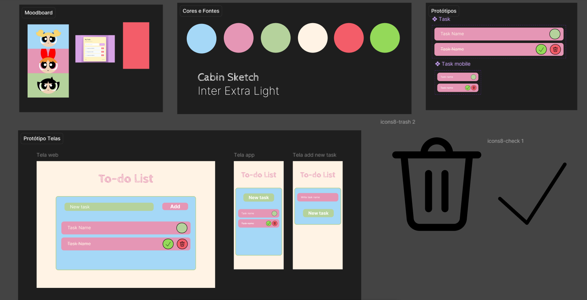

# To-do List

Aplicação de gerenciamento de tarefas responsiva desenvolvida com HTML, CSS e JavaScript.

Link: *https://andressa-barros.github.io/to-do-list/*

---

## Funcionalidades

- **Adicionar Tarefas**: Criação de tarefas para versão desktop e mobile.
- **Concluir Tarefas**: Marcar tarefa como concluída (exibe o botão de check e risca o texto).
- **Excluir Tarefas**: Botão de lixeira exibido ao marcar a tarefa como concluída.
- **Design Responsivo**: Adaptação para telas menores (smartphones).

---
## Protótipo Figma

---
